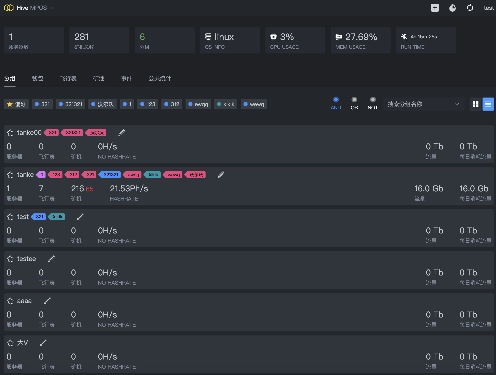

&nbsp;
<p align="center">
  <picture>
    <source media="(prefers-color-scheme: dark)" srcset="img/log.svg">
    
  </picture>
</p>
<h3 align="center">一款矿工抽水软件群控管理服务>
<p align="center">
  免费使用，强大集群管理，0.18%算力开发费.
</p>
  <p align="center">
    <a href="https://hiveminerproxy.com/">hiveminerproxy.com</a> |
    <a href="">Reddit</a> |
    <a href="">Twitter</a> |
    <a href="">Telegram</a>
    <br/><br/>
  <a>
    
  </a>
  <a>
    
  </a>
  <a>
    
  </a>
  <a>
    
  </a>
</p>
<br/>
<p align="center">
  
</p>
<hr/>


### 一键安装脚本最新版本Linux amd64
  ```shell
   bash <(curl -s -L https://raw.githubusercontent.com/hivecassiny/HiveMPOS/main/install.sh)
  ```

